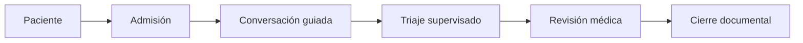
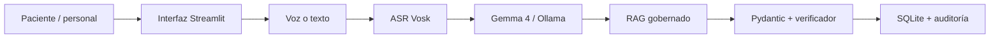

[English](README.md) | [Español]

<p align="center">
  
</p>

<h1 align="center">TRIaje 360</h1>

<p align="center">
  Admisión asistida por IA, triaje supervisado y continuidad clínica longitudinal
</p>

<p align="center">
  
  
  
  
  
  <a href="https://github.com/YanFranko-GS/Triaje-360-Auditor-Cl-nico-Inteligente/actions/workflows/tests.yml"></a>
  <a href="LICENSE"></a>
</p>

> [!IMPORTANT]
> TRIaje 360 es una plataforma de investigación y validación que usa datos sintéticos. No es un dispositivo médico certificado, no diagnostica ni prescribe y no sustituye la evaluación profesional ni los servicios de emergencia.

## Resumen

TRIaje 360 es una plataforma asistida por IA para admisión estructurada, triaje supervisado, contexto clínico longitudinal y documentación auditable. Combina reconocimiento local de voz, Gemma 4, generación aumentada por recuperación, validación determinista y flujos por rol. Ayuda al paciente a comunicar síntomas, al personal sanitario a detectar información faltante y al profesional a revisar contexto trazable sin automatizar el diagnóstico ni reemplazar el juicio clínico.

## Contenido

- [Por qué existe TRIaje 360](#por-qué-existe-triaje-360)
- [El problema](#el-problema)
- [Qué hace la plataforma](#qué-hace-la-plataforma)
- [Flujo real](#flujo-real)
- [Capturas y demostración](#capturas-y-demostración)
- [Arquitectura](#arquitectura-del-sistema)
- [Seguridad y evidencia](#modelo-de-seguridad-clínica)
- [Instalación](#requisitos)
- [Acceso demo](#cuentas-demo)
- [Pruebas](#ejecutar-pruebas)
- [Replicación con agentes de IA](#replicación-con-agentes-de-ia)
- [Contribución y hoja de ruta](#contribuir)
- [Limitaciones, privacidad y licencia](#limitaciones-conocidas)

## Por qué existe TRIaje 360

La admisión clínica suele comenzar con un relato libre e incompleto que atraviesa varias transferencias. TRIaje 360 explora cómo la IA local, la confirmación explícita, la recuperación gobernada y las comprobaciones deterministas pueden mejorar la completitud documental y mantener las decisiones en manos de profesionales autorizados.

## El problema

- El paciente puede omitir duración, características del dolor, alergias o síntomas acompañantes.
- Triaje debe conciliar relato, antecedentes, signos vitales y reglas locales con poco tiempo.
- El médico necesita contexto longitudinal y procedencia, no una respuesta generada opaca.
- La IA puede fallar, omitir o producir contenido sin respaldo; por eso necesita validación y respaldo.
- Un flujo sensible requiere procesamiento local, datos sintéticos, mínimo privilegio y auditoría.

## Qué hace la plataforma

La interfaz en español permite registro e ingreso del paciente, admisión por texto o voz local, completado de campos con una pregunta por vez, triaje supervisado de cinco niveles, revisión médica, historia longitudinal, recuperación de evidencia gobernada, trazabilidad de ejecuciones del modelo, auditoría y catálogo administrativo seguro del esquema.

## Flujo real



1. El paciente sintético se autentica o registra y brinda consentimiento explícito.
2. Habla o escribe, revisa la transcripción y confirma los campos extraídos.
3. Gemma 4 y las reglas detectan estructura, faltantes, contradicciones y señales de revisión.
4. Triaje registra signos vitales y acepta, modifica, escala o solicita reevaluar la propuesta.
5. El médico revisa contexto, historia, evidencia, pendientes y decisiones profesionales.
6. Las ejecuciones del modelo, recuperaciones RAG, cambios y cierres quedan auditados en SQLite.

## Capacidades principales

- Inferencia local con Gemma 4 mediante Ollama y respaldo determinista.
- Admisión manual por texto y reconocimiento opcional de español con Vosk.
- Esquemas Pydantic y segunda etapa de completitud y contradicciones.
- RAG léxico sobre fuentes aprobadas con procedencia, aplicabilidad y limitaciones.
- Roles de paciente, enfermería, médico de triaje, médico tratante, supervisor y administrador.
- Migraciones SQLite idempotentes, semillas sintéticas, sesiones, contraseñas con hash y auditoría.
- Interfaz adaptable con estado de IA visible y confirmación profesional explícita.
- Pruebas unitarias, de integración, seguridad RAG, voz, autenticación, flujo y lanzadores Windows.

## Capturas y demostración

Los recursos siguientes se capturaron en la aplicación local real a 1440×900 y solo contienen registros sintéticos. El GIF es una secuencia optimizada de 14 segundos construida con esas capturas reales.

<p align="center">
  
</p>

| Acceso del paciente | Acceso del personal sanitario |
| --- | --- |
|  |  |

| Admisión del paciente | Estado de IA y ejecución |
| --- | --- |
|  |  |

| Triaje supervisado | Espacio médico |
| --- | --- |
|  |  |

| Auditoría | Visor seguro de base de datos |
| --- | --- |
|  |  |

Consulta la [galería completa](docs/assets/screenshots/) y la [guía de acceso demo](docs/DEMO_ACCESS.md).

## Arquitectura del sistema



El uso solo por texto omite Vosk. Si la IA falla se activa el respaldo determinista y la revisión profesional continúa siendo obligatoria. Consulta el [resumen de arquitectura](docs/architecture-overview.md) y la [arquitectura técnica ampliada](ARCHITECTURE.md).

## Acceso por roles

| Rol | Acceso principal | Responsabilidad esperada |
| --- | --- | --- |
| Paciente | Admisión, historia propia y seguimiento | Confirmar su información sintética |
| Enfermería de triaje | Estación de triaje | Registrar observaciones y decisión supervisada |
| Médico de triaje | Estación de triaje | Revisar o escalar dentro del establecimiento |
| Médico tratante | Panel médico | Revisar contexto longitudinal y documental |
| Supervisor | Vistas operativas y auditoría | Revisar trazabilidad y estado del flujo |
| Administrador | Vistas demo y catálogo seguro | Mantener el entorno sintético local |

Los permisos se aplican en navegación y operaciones, pero no constituyen un sistema de autorización para producción.

## Canal de IA

1. Normaliza el relato confirmado.
2. Solicita extracción estructurada al modelo principal (`gemma4:e2b`).
3. Valida con Pydantic y rechaza respuestas mal formadas.
4. Ejecuta una segunda revisión de completitud y contradicciones.
5. Usa extracción o análisis determinista si Ollama no está disponible o la salida es inválida.
6. Persiste proveedor, modelo, `model_used`, estado, duración, motivo de respaldo y validación.

La salida del modelo es apoyo documental, nunca diagnóstico, receta ni decisión clínica autónoma.

## Canal de voz

`st.audio_input` captura segmentos de hasta 30 segundos tras un consentimiento separado. Se validan MIME, duración, señal, canales y frecuencia; WAV se normaliza a mono 16 kHz; se guarda hash SHA-256 y metadatos, no el audio por defecto; Vosk puede transcribir localmente; y el paciente debe editar y confirmar el texto. Instala `requirements-voice.txt` y coloca un modelo compatible de español bajo `.demo/asr_models/`.

## RAG y gobierno de evidencia

Solo se ingieren entradas aprobadas en `docs/source_register.csv`. La recuperación léxica conserva identificador de fuente y fragmento, puntaje, motivo, población, aplicabilidad y limitaciones. Los registros clínicos nunca forman parte del corpus. Una fuente recuperada no se convierte en protocolo local ni implica respaldo institucional.

## Modelo de seguridad clínica

- Consentimiento del paciente y confirmación del texto y campos.
- Pydantic más reglas deterministas de contradicción y completitud.
- Estado de IA, modelo, validación y causa del respaldo visibles.
- Propuesta configurable de cinco niveles con aceptar, modificar, escalar o reevaluar.
- Vistas por rol, contraseñas demo con hash, sesiones locales y eventos auditables.
- Política de datos solo sintéticos, sin diagnóstico, prescripción ni cierre automático.
- Validación profesional para cada decisión con impacto clínico.

Lee [seguridad y limitaciones](docs/safety_and_limitations.md) antes de extender el proyecto.

## Tecnologías

| Capa | Tecnología |
| --- | --- |
| Interfaz | Python 3.12, Streamlit 1.49, Altair, Pandas |
| IA local | API compatible con Ollama 0.32, `gemma4:e2b` |
| Validación | Pydantic 2 y reglas deterministas en Python |
| Voz | Entrada Streamlit, preprocesamiento WAV, Vosk opcional |
| Recuperación | Fragmentos JSON aprobados, búsqueda léxica, validación de citas |
| Persistencia | SQLite con claves foráneas y migraciones idempotentes |
| Pruebas | pytest, marcador de integración y smoke test Windows |

## Estructura del repositorio

```text
TRIaje-360/
├── app.py                    # Entrada Streamlit y navegación
├── auth_service.py           # Autenticación y sesiones demo
├── clinical_db.py            # Esquema, semillas y auditoría
├── longitudinal_db.py        # Vista relacional longitudinal
├── intake_service.py         # Extracción y preguntas de seguimiento
├── clinical_verifier.py      # Completitud y contradicciones
├── triage_service.py         # Propuesta configurable de cinco niveles
├── audio_pipeline.py         # Preprocesamiento WAV seguro
├── services/                 # Adaptadores de Ollama y ASR local
├── rag/                      # Ingesta, recuperación y seguridad
├── ui/                       # Vistas Streamlit por rol
├── scripts/                  # Semillas, inspección y lanzadores
├── tests/                    # Pruebas unitarias e integración local
├── docs/                     # Arquitectura, fuentes, acceso y medios
└── .github/                  # CI y plantillas de colaboración
```

## Requisitos

- Windows 10/11 para los lanzadores incluidos.
- Python 3.12.
- Ollama local en `127.0.0.1:11434`.
- Aproximadamente 8 GB libres para `gemma4:e2b` y el entorno Python.
- RAM suficiente; la configuración validada usa CPU.
- Micrófono y modelo Vosk local solo para probar voz.

## Inicio rápido en Windows

```powershell
git clone https://github.com/YanFranko-GS/Triaje-360-Auditor-Cl-nico-Inteligente.git
cd Triaje-360-Auditor-Cl-nico-Inteligente
```

Haz doble clic en `INICIAR_TRIAJE360.bat`. El lanzador crea o repara `.venv`, genera `.env` desde `.env.example`, inicializa datos sintéticos, comprueba Ollama y abre la aplicación. No instala Ollama ni descarga silenciosamente el modelo.

- `00_INSTALAR_O_REPARAR.bat`: entorno y datos sintéticos.
- `01_PROBAR_TODO.bat`: smoke test local completo.
- `02_INICIAR_TRIAJE360.bat`: inicio validado.
- `03_DETENER_TRIAJE360.bat`: detiene solo el proceso Streamlit registrado.

## Instalación manual

```powershell
py -3.12 -m venv .venv
.\.venv\Scripts\python.exe -m pip install --upgrade pip
.\.venv\Scripts\python.exe -m pip install -r requirements.txt
Copy-Item .env.example .env
ollama pull gemma4:e2b
.\.venv\Scripts\python.exe scripts\create_demo_accounts.py
.\.venv\Scripts\python.exe scripts\seed_demo_data.py
.\.venv\Scripts\python.exe -m pytest -q
.\02_INICIAR_TRIAJE360.bat
```

La base se genera localmente con migraciones y semillas idempotentes; no se necesita un SQLite previo.

## Configuración de Ollama y Gemma

```powershell
ollama --version
ollama serve
ollama pull gemma4:e2b
ollama list
```

Mantén Ollama limitado a localhost y usa en `.env`:

```dotenv
OLLAMA_BASE_URL=http://localhost:11434
OLLAMA_MODEL=gemma4:e2b
PRIMARY_MODEL=gemma4:e2b
REVIEW_MODEL=gemma4:e2b
OLLAMA_NUM_GPU=0
```

El repositorio valida esa etiqueta local exacta; disponibilidad y rendimiento dependen de la instalación y equipo del usuario.

## Cuentas demo

Estas credenciales son deliberadamente públicas, sintéticas y solo locales:

| Perfil | Credencial | Establecimiento |
| --- | --- | --- |
| Paciente existente | DNI `76543210`, fecha `1999-01-01` | Centro Andino |
| Enfermería | `nurse.demo` / `Clinica360-N1!` | Centro Andino |
| Médico de triaje | `triage.doctor` / `Clinica360-TD!` | Policlínico Costa |
| Médico tratante | `attending.demo` / `Clinica360-M1!` | Centro Andino |
| Supervisor | `supervisor.demo` / `Clinica360-S1!` | Centro Andino |
| Administrador | `admin.demo` / `Clinica360-A1!` | Centro Andino |

La [guía de acceso demo](docs/DEMO_ACCESS.md) detalla permisos y recorrido.

## Pacientes demo

La semilla crea diez perfiles clínicos sintéticos. Usa `76543210` para el paciente existente o **Registrar nuevo paciente** para crear uno. Otros accesos son `87654321` / `1990-02-02` y `11223344` / `1985-03-03`. Nunca ingreses identidad ni información sanitaria real.

## Ejecutar pruebas

```powershell
# Suite completa, incluida la integración local con Gemma
.\.venv\Scripts\python.exe -m pytest -q

# Suite segura para CI, sin inferencia local
.\.venv\Scripts\python.exe -m pytest -q -m "not integration"
```

La línea base pública está en [github_release_baseline.md](docs/github_release_baseline.md).

## Ejecutar el smoke test

```powershell
.\01_PROBAR_TODO.bat
```

Comprueba entorno, `.env`, SQLite, API de Ollama, etiqueta exacta de Gemma, inferencia real, respaldo determinista, pytest y salud de Streamlit. El éxito exige HTTP 200 en `http://127.0.0.1:8501/_stcore/health`.

## Inspección de base de datos

```powershell
.\.venv\Scripts\python.exe scripts\inspect_database.py
.\.venv\Scripts\python.exe scripts\export_schema.py
```

La vista administrativa solo expone catálogo, conteos, columnas y claves foráneas; excluye hashes, sales y secretos. Git ignora toda base local.

## Replicación con agentes de IA

El agente debe empezar por [AGENTS.md](AGENTS.md) y continuar con la [guía de replicación](docs/AI_REPLICATION_GUIDE.md). Debe inspeccionar, crear un entorno aislado, verificar Ollama y Gemma, generar datos sintéticos, ejecutar pruebas y smoke test, y presentar evidencia antes de cambiar código. No debe inventar resultados.

## Contribuir

Haz fork, crea una rama desde `develop`, conserva datos sintéticos, ejecuta la suite segura para CI y las integraciones pertinentes, y abre un Pull Request enfocado. No subas `.env`, bases, logs, audios, modelos ni información clínica real. Lee [CONTRIBUTING.md](CONTRIBUTING.md), el [Código de conducta](CODE_OF_CONDUCT.md) y [SECURITY.md](SECURITY.md).

## Hoja de ruta

- Estudios de usabilidad revisados desde privacidad con datos sintéticos o formalmente gobernados.
- Configuración de triaje por establecimiento versionada y validada por profesionales.
- Evaluación multilingüe, accesible y de voz en condiciones adversas.
- Evaluación RAG, ciclo de vida de fuentes y regresiones de modelos más robustas.
- Frontera de identidad de producción solo en un diseño separado y revisado.
- Métricas de latencia, completitud, omisiones y anulaciones humanas por hardware.

## Limitaciones conocidas

- Es una demo local de investigación, no un sistema clínico productivo ni estándar oficial peruano.
- La latencia y disponibilidad de `gemma4:e2b` dependen del equipo; el respaldo es más limitado.
- Vosk necesita un modelo separado y no está validado para todo acento, dispositivo o ruido.
- El RAG léxico es pequeño y no demuestra aplicabilidad clínica por sí mismo.
- Autenticación demo, SQLite local y sesiones Streamlit no son arquitectura de producción.
- Los relatos sembrados pueden ser poco naturales porque son fixtures sintéticos.
- `audioop` está obsoleto y debe reemplazarse antes de Python 3.13.

## Privacidad y seguridad

Usa solo datos sintéticos. No expongas Streamlit ni Ollama a la red sin un modelo de amenazas, autenticación, cifrado, monitoreo y gobierno clínico separados. El audio no se almacena por defecto, pero los metadatos también serían sensibles en un despliegue real. Reporta problemas en privado según [SECURITY.md](SECURITY.md).

## Licencia

Distribuido bajo [Apache License 2.0](LICENSE). Modelos, fuentes, logotipos y activos Vosk conservan sus propias licencias. Ningún logotipo institucional implica asociación, respaldo o aprobación.

## Equipo

TRIaje 360 es un proyecto abierto de investigación y validación de **KutanLab**. Se reciben contribuciones de desarrollo, salud, investigación, diseño, seguridad y documentación mediante issues y Pull Requests.
