[English] | [Español](README.es.md)

<p align="center">
  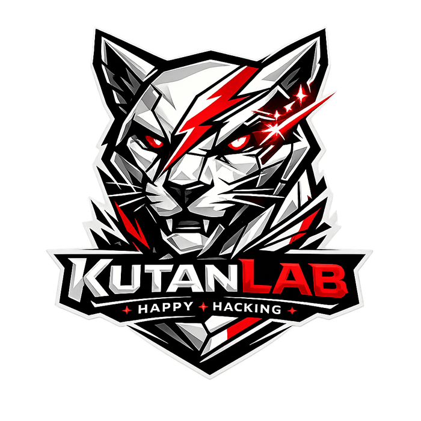
</p>

<h1 align="center">TRIaje 360</h1>

<p align="center">
  AI-assisted patient intake, supervised triage, and longitudinal clinical continuity
</p>

<p align="center">
  
  
  
  
  
  <a href="https://github.com/YanFranko-GS/Triaje-360-Auditor-Cl-nico-Inteligente/actions/workflows/tests.yml"></a>
  <a href="LICENSE"></a>
</p>

> [!IMPORTANT]
> TRIaje 360 is a research and validation platform that uses synthetic data. It is not a certified medical device, does not diagnose or prescribe, and must not replace professional assessment or emergency services.

## Abstract

TRIaje 360 is an AI-assisted platform for structured patient intake, supervised triage, longitudinal clinical context, and auditable documentation. It combines local speech recognition, Gemma 4, retrieval-augmented generation, deterministic validation, and role-based workflows. The system helps patients communicate symptoms, helps healthcare staff identify missing information, and gives professionals traceable context without automating diagnosis or replacing clinical judgment.

## Table of contents

- [Why TRIaje 360 exists](#why-triaje-360-exists)
- [The problem](#the-problem)
- [What the platform does](#what-the-platform-does)
- [Real workflow](#real-workflow)
- [Screenshots and demo](#screenshots-and-demo)
- [System architecture](#system-architecture)
- [Safety and evidence](#clinical-safety-model)
- [Installation](#requirements)
- [Demo access](#demo-accounts)
- [Tests](#running-tests)
- [AI-agent replication](#ai-agent-replication)
- [Contributing and roadmap](#contributing)
- [Limitations, privacy, and license](#known-limitations)

## Why TRIaje 360 exists

Clinical intake often begins with an incomplete free-text narrative that must be interpreted across several handoffs. TRIaje 360 explores how local AI, explicit confirmation, governed retrieval, and deterministic checks can improve documentation completeness while keeping decisions with authorized professionals.

## The problem

- Patients may omit duration, pain characteristics, allergies, or accompanying symptoms.
- Triage staff must reconcile narrative, history, vital signs, and local rules under time pressure.
- Physicians need longitudinal context and provenance, not an opaque generated answer.
- AI outputs can be incomplete, unsupported, or unavailable and therefore need validation and fallback behavior.
- Sensitive workflows require local-first processing, synthetic test data, least-privilege access, and auditable changes.

## What the platform does

The Spanish-language Streamlit interface supports patient registration and login, text or local voice intake, one-question-at-a-time completion, supervised five-level triage, a physician review workspace, longitudinal records, governed evidence retrieval, model-run traceability, audit events, and a safe administrative schema viewer.

## Real workflow

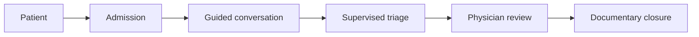

1. A synthetic patient authenticates or registers and explicitly consents.
2. The patient speaks or types a narrative, reviews the transcription, and confirms extracted fields.
3. Gemma 4 and deterministic checks identify structure, missing fields, contradictions, and review signals.
4. Triage staff record vital signs and accept, change, escalate, or request reevaluation of the proposed level.
5. A physician reviews current context, history, evidence, pending data, and professional decisions.
6. Model runs, RAG retrievals, changes, and closure events remain auditable in SQLite.

## Key capabilities

- Local-first Gemma 4 inference through Ollama with a deterministic fallback.
- Manual text intake and optional Vosk-based Spanish speech recognition.
- Pydantic schemas plus a second completeness and contradiction verifier.
- Approved-source lexical RAG with source IDs, applicability, and limitations.
- Patient, triage nurse, triage physician, attending physician, supervisor, and administrator roles.
- Idempotent SQLite migrations, synthetic seeds, sessions, password hashing, and audit events.
- Responsive Spanish interface with visible AI state and explicit professional confirmation.
- Unit, integration, workflow, RAG safety, voice, authentication, and Windows launcher tests.

## Screenshots and demo

The following media was captured from the running local application at 1440×900 using only synthetic demo records. The GIF is an optimized 14-second sequence assembled from those real captures.

<p align="center">
  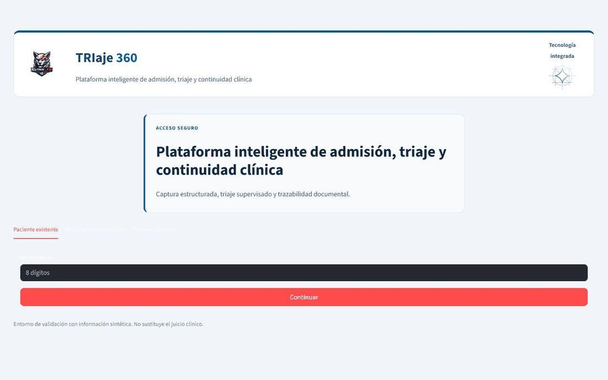
</p>

| Patient access | Healthcare staff access |
| --- | --- |
|  | 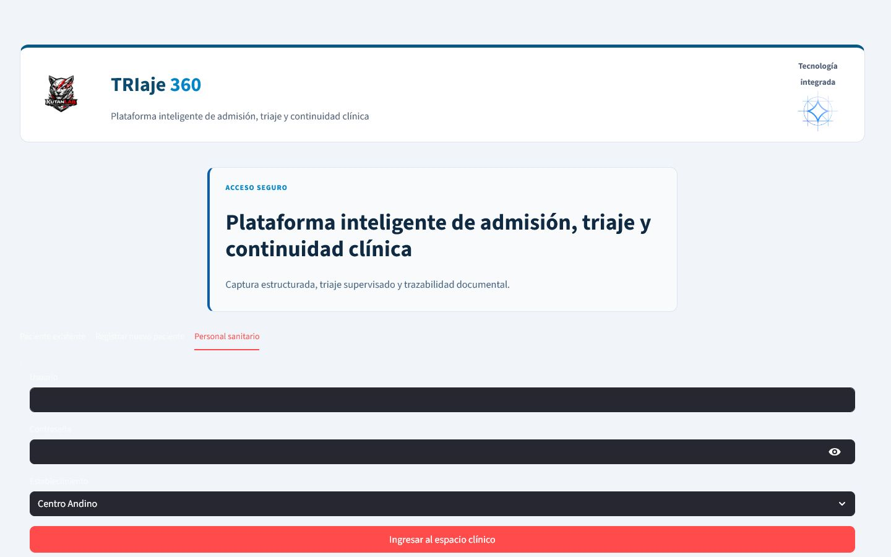 |

| Patient intake | AI and runtime status |
| --- | --- |
| 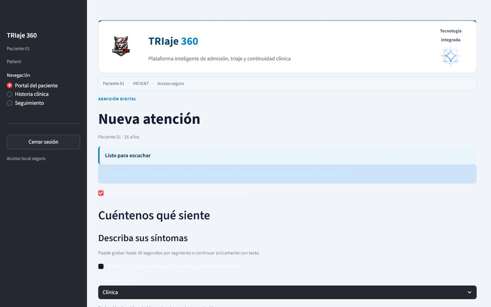 | 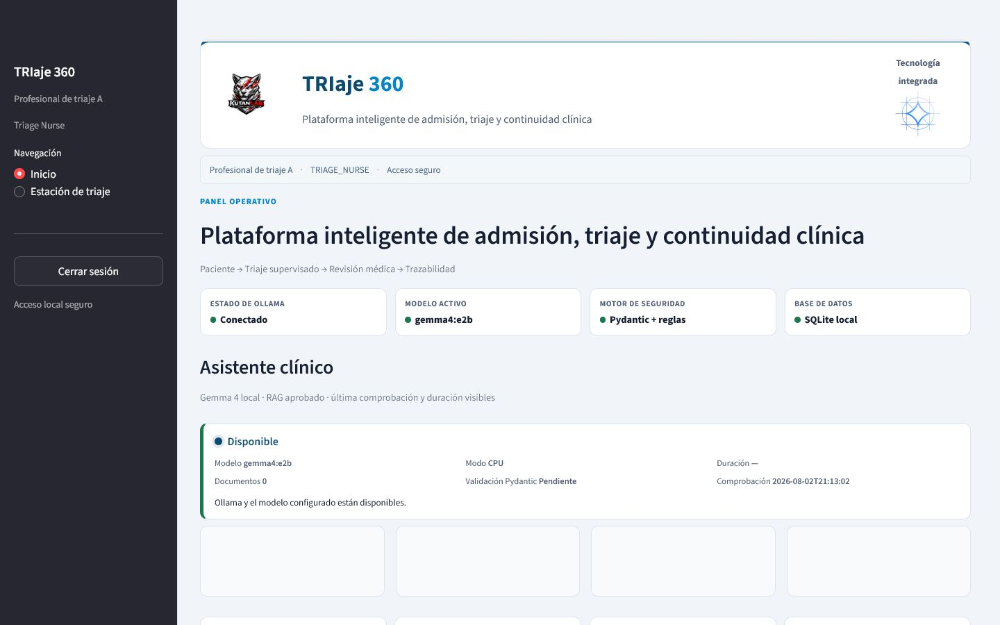 |

| Supervised triage | Physician workspace |
| --- | --- |
| 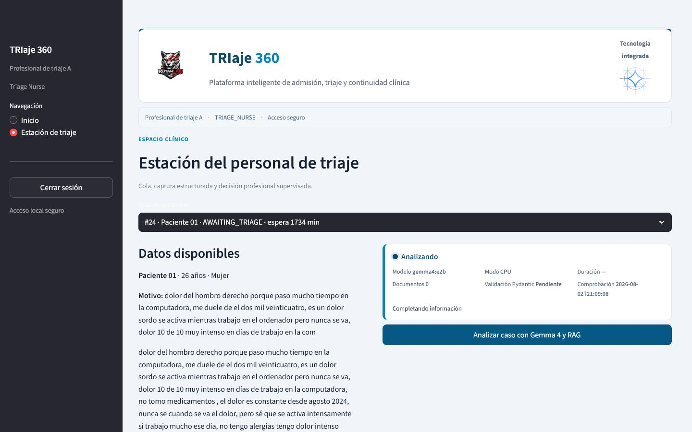 | 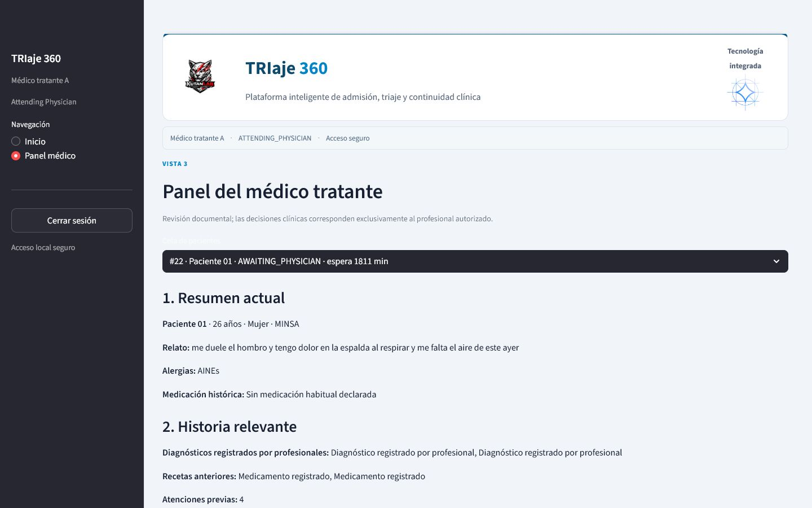 |

| Audit trail | Safe database viewer |
| --- | --- |
| 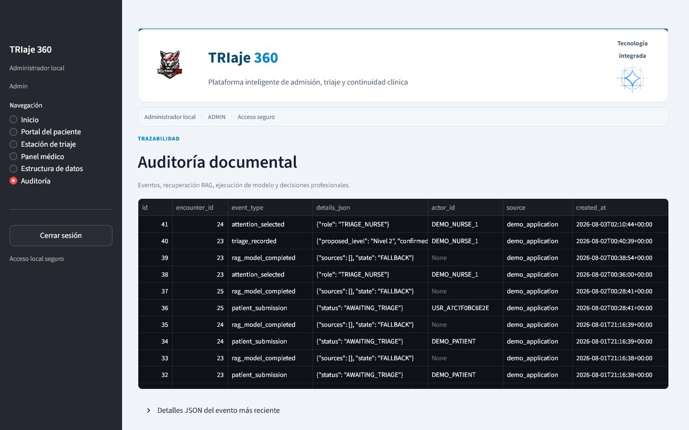 | 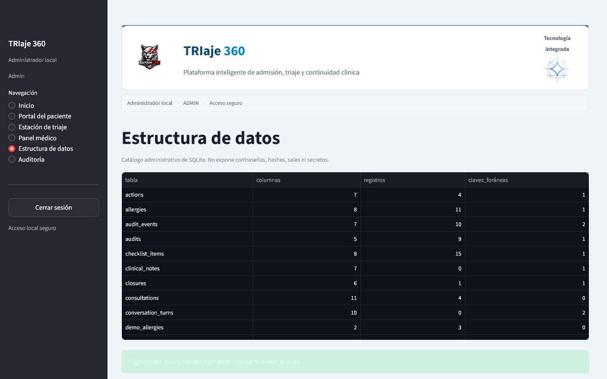 |

See the complete [screenshot gallery](docs/assets/screenshots/) and [demo access guide](docs/DEMO_ACCESS.md).

## System architecture

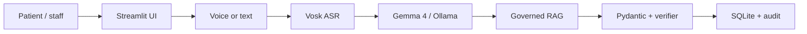

Text-only use bypasses Vosk. AI failures take the deterministic fallback path, and professional review remains mandatory. See [architecture overview](docs/architecture-overview.md) and the expanded [technical architecture](ARCHITECTURE.md).

## Role-based access

| Role | Main access | Expected responsibility |
| --- | --- | --- |
| Patient | Intake, own history, tracking | Confirm their own synthetic information |
| Triage nurse | Triage station | Record structured observations and a supervised decision |
| Triage physician | Triage station | Review/escalate triage within the configured facility |
| Attending physician | Physician panel | Review longitudinal and documentary context |
| Supervisor | Operational and audit views | Review traceability and workflow state |
| Administrator | All demo views and safe schema catalog | Maintain the local synthetic environment |

Permissions are enforced in navigation and service operations; they are not a production authorization system.

## AI pipeline

1. Normalize the confirmed narrative.
2. Request structured extraction from the configured primary model (`gemma4:e2b`).
3. Validate the response with Pydantic and reject malformed output.
4. Run a separate completeness/contradiction review stage.
5. Use deterministic extraction or analysis when Ollama is unavailable or invalid.
6. Persist provider, model name, `model_used`, state, duration, fallback reason, and validation status.

Model output is a documentation aid. It is never treated as diagnosis, prescription, or an autonomous clinical decision.

## Voice pipeline

`st.audio_input` captures a maximum 30-second segment after separate consent. The pipeline validates MIME type, duration, signal level, channel count, and sample rate; normalizes WAV audio to mono 16 kHz; stores a SHA-256 and metadata rather than the audio by default; optionally transcribes locally with Vosk; and requires the patient to edit and confirm the text. Install voice support separately with `requirements-voice.txt` and provide a compatible Spanish Vosk model under `.demo/asr_models/`.

## RAG and evidence governance

Only records in `docs/source_register.csv` with approved status are ingested. Retrieval is lexical and keeps source ID, chunk ID, score, reason, population, applicability, and limitations. Clinical records are never part of the evidence corpus. Retrieved material provides context for professional review and does not convert a source into a local protocol or institutional endorsement.

## Clinical safety model

- Explicit patient consent and confirmation of text and structured fields.
- Pydantic validation plus deterministic contradiction and completeness checks.
- Visible AI state, model identity, validation state, and fallback reason.
- Configurable five-level proposal with accept/change/escalate/reevaluate actions.
- Role-scoped views, hashed demo passwords, local sessions, and audit events.
- Synthetic-only data policy and no diagnosis, prescribing, or automatic closure.
- Professional validation required for every clinically meaningful decision.

Read [safety and limitations](docs/safety_and_limitations.md) before extending the project.

## Technology stack

| Layer | Technology |
| --- | --- |
| UI | Python 3.12, Streamlit 1.49, Altair, Pandas |
| Local AI | Ollama 0.32-compatible API, `gemma4:e2b` |
| Validation | Pydantic 2, deterministic Python rules |
| Voice | Streamlit audio input, WAV preprocessing, optional Vosk |
| Retrieval | Approved JSON chunks, lexical retrieval, citation validation |
| Persistence | SQLite with foreign keys and idempotent migrations |
| Testing | pytest, integration marker, Windows smoke launcher |

## Repository structure

```text
TRIaje-360/
├── app.py                    # Streamlit entry point and navigation
├── auth_service.py           # Demo authentication and sessions
├── clinical_db.py            # Demo workflow schema, seeds, and audit
├── longitudinal_db.py        # Longitudinal relational view
├── intake_service.py         # Structured extraction and follow-up
├── clinical_verifier.py      # Completeness and contradiction stage
├── triage_service.py         # Configurable five-level proposal
├── audio_pipeline.py         # Safe WAV preprocessing
├── services/                 # Ollama and local ASR adapters
├── rag/                      # Approved ingestion, retrieval, safety
├── ui/                       # Role-based Streamlit views
├── scripts/                  # Seeds, inspection, launcher utilities
├── tests/                    # Unit and local integration tests
├── docs/                     # Architecture, evidence, access, media
└── .github/                  # CI and collaboration templates
```

## Requirements

- Windows 10/11 for the provided launchers; manual startup also works from PowerShell.
- Python 3.12 (64-bit recommended).
- Ollama running locally on `127.0.0.1:11434`.
- Approximately 8 GB of free disk space for `gemma4:e2b` plus the Python environment.
- CPU inference works and is the validated default; sufficient RAM is required for the local model.
- Microphone and an optional local Vosk model only when testing voice intake.

## Quick start for Windows

```powershell
git clone https://github.com/YanFranko-GS/Triaje-360-Auditor-Cl-nico-Inteligente.git
cd Triaje-360-Auditor-Cl-nico-Inteligente
```

Double-click `INICIAR_TRIAJE360.bat`. The launcher creates or repairs `.venv`, creates `.env` from `.env.example`, initializes synthetic data, checks Ollama, and opens the local application. It does not install Ollama or silently download the model.

Useful launchers:

- `00_INSTALAR_O_REPARAR.bat` — environment and synthetic-data setup.
- `01_PROBAR_TODO.bat` — full local smoke test.
- `02_INICIAR_TRIAJE360.bat` — validated application start.
- `03_DETENER_TRIAJE360.bat` — stop only the recorded Streamlit process.

## Manual installation

```powershell
py -3.12 -m venv .venv
.\.venv\Scripts\python.exe -m pip install --upgrade pip
.\.venv\Scripts\python.exe -m pip install -r requirements.txt
Copy-Item .env.example .env
ollama pull gemma4:e2b
.\.venv\Scripts\python.exe scripts\create_demo_accounts.py
.\.venv\Scripts\python.exe scripts\seed_demo_data.py
.\.venv\Scripts\python.exe -m pytest -q
.\02_INICIAR_TRIAJE360.bat
```

All databases are generated locally from idempotent migrations and synthetic seeds. A pre-existing SQLite file is not required.

## Ollama and Gemma setup

```powershell
ollama --version
ollama serve
ollama pull gemma4:e2b
ollama list
```

Keep Ollama bound to localhost. Configure the application in `.env`:

```dotenv
OLLAMA_BASE_URL=http://localhost:11434
OLLAMA_MODEL=gemma4:e2b
PRIMARY_MODEL=gemma4:e2b
REVIEW_MODEL=gemma4:e2b
OLLAMA_NUM_GPU=0
```

The repository validates the exact local tag shown above; availability and hardware performance depend on the user's Ollama installation and machine.

## Demo accounts

These credentials are deliberately public, synthetic, and local-only:

| Profile | Credential | Facility |
| --- | --- | --- |
| Existing patient | DNI `76543210`, birth date `1999-01-01` | Centro Andino |
| Triage nurse | `nurse.demo` / `Clinica360-N1!` | Centro Andino |
| Triage physician | `triage.doctor` / `Clinica360-TD!` | Policlínico Costa |
| Attending physician | `attending.demo` / `Clinica360-M1!` | Centro Andino |
| Supervisor | `supervisor.demo` / `Clinica360-S1!` | Centro Andino |
| Administrator | `admin.demo` / `Clinica360-A1!` | Centro Andino |

See [DEMO_ACCESS.md](docs/DEMO_ACCESS.md) for permissions and a test itinerary.

## Demo patients

The seed creates ten synthetic clinical profiles plus access records. Use `76543210` for an existing patient, or select **Register new patient** to create a new synthetic profile. Additional seeded identifiers include `87654321` / `1990-02-02` and `11223344` / `1985-03-03`. Never enter real identity or health information.

## Running tests

```powershell
# Complete suite, including local Gemma integration when Ollama is available
.\.venv\Scripts\python.exe -m pytest -q

# CI-safe tests without local Ollama inference
.\.venv\Scripts\python.exe -m pytest -q -m "not integration"
```

The public release baseline is recorded in [github_release_baseline.md](docs/github_release_baseline.md).

## Running the smoke test

```powershell
.\01_PROBAR_TODO.bat
```

The smoke test checks the virtual environment, `.env`, SQLite initialization, Ollama API, exact Gemma tag, real inference, deterministic fallback, pytest suite, and Streamlit health response. Success requires HTTP 200 from `http://127.0.0.1:8501/_stcore/health`.

## Database inspection

```powershell
.\.venv\Scripts\python.exe scripts\inspect_database.py
.\.venv\Scripts\python.exe scripts\export_schema.py
```

The admin UI exposes only a safe catalog of table names, counts, columns, and foreign keys. It intentionally excludes password hashes, salts, and secrets. Local `.db` files are ignored by Git.

## AI-agent replication

Agents must begin with [AGENTS.md](AGENTS.md), then follow the human-oriented [AI replication guide](docs/AI_REPLICATION_GUIDE.md). The required initial behavior is: inspect first, create an isolated environment, verify Ollama and Gemma, generate synthetic data, run tests and the smoke test, and report evidence before changing code. Agents must not claim results they did not execute.

## Contributing

Fork the repository, branch from `develop`, keep data synthetic, run the CI-safe suite and any relevant local integration tests, and open a focused pull request. Do not commit `.env`, databases, logs, audio, model files, or real clinical information. Read [CONTRIBUTING.md](CONTRIBUTING.md), the [Code of Conduct](CODE_OF_CONDUCT.md), and [SECURITY.md](SECURITY.md).

## Roadmap

- Add privacy-reviewed usability studies with synthetic or formally governed data.
- Version facility-specific triage configuration and validate it with domain professionals.
- Expand multilingual, accessibility, and adverse-condition voice evaluation.
- Add stronger retrieval evaluation, source lifecycle management, and model regression fixtures.
- Introduce a production-grade identity boundary only in a separate, security-reviewed deployment design.
- Measure latency, completeness, false omission, and human override behavior across supported hardware.

## Known limitations

- This is a local research demo, not a production clinical system or official Peruvian triage standard.
- `gemma4:e2b` latency and availability depend on local hardware and Ollama; deterministic fallback is narrower than model extraction.
- Vosk requires a separately supplied model and has not been validated for every accent, device, or noisy setting.
- Lexical RAG is intentionally small and does not establish clinical applicability by itself.
- Demo authentication, single-machine SQLite, and Streamlit session state are not production security architecture.
- Seeded narratives may be awkward because they are synthetic validation fixtures.
- The audio preprocessing module uses Python's deprecated `audioop`, which must be replaced before Python 3.13.

## Privacy and safety

Use synthetic data only. Do not expose Streamlit or Ollama to a LAN or the internet without a separate threat model, authentication layer, encryption, monitoring, and clinical governance review. Audio storage is disabled by default; metadata and hashes may still be sensitive in a real deployment. Report security issues privately as described in [SECURITY.md](SECURITY.md).

## License

Licensed under the [Apache License 2.0](LICENSE). Third-party models, source documents, logos, and optional Vosk assets retain their own licenses and usage terms. No institutional logo is used to imply partnership, endorsement, or approval.

## Team

TRIaje 360 is an open research and validation project by **KutanLab**. Contributions from developers, healthcare professionals, researchers, designers, safety reviewers, and documentation specialists are welcome through GitHub issues and pull requests.
