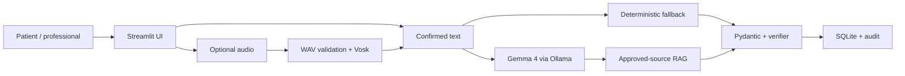
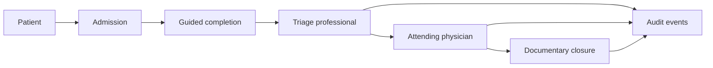

# TRIaje 360 architecture overview

This overview describes the executable local demo on the public branch. It is a research architecture using synthetic data, not a production clinical deployment design.

## Runtime architecture

Text input goes directly to the confirmed narrative. Audio is optional and remains a separate consented path. Ollama output is untrusted: Pydantic validation and the independent completeness verifier gate it. When Ollama is absent, times out, or returns invalid content, deterministic extraction provides a narrower fallback and the reason is recorded.

## Operational workflow

Patient confirmation, professional triage disposition, and documentary closure are separate gates. The model does not advance a clinical state on its own.

## Component responsibilities

| Boundary | Main files | Responsibility |
| --- | --- | --- |
| Application shell | `app.py`, `ui/navigation.py`, `ui/layout.py` | Authentication gate, role navigation, shared layout |
| Patient intake | `ui/patient_portal.py`, `intake_service.py` | Consent, narrative, structured extraction, follow-up, confirmation |
| Voice | `ui/audio_capture.py`, `audio_pipeline.py`, `services/local_asr.py` | Capture, signal checks, normalization, optional local ASR |
| AI | `services/ollama_client.py`, `clinical_verifier.py`, `schemas.py` | Local inference, schema validation, fallback, independent review |
| Evidence | `rag/`, `docs/source_register.csv` | Approved ingestion, retrieval, safety, citation payloads |
| Triage | `ui/triage_workspace.py`, `ui/pages.py`, `triage_service.py` | Queue, observations, configurable proposal, professional disposition |
| Longitudinal review | `ui/physician_workspace.py`, `ui/longitudinal_views.py`, `longitudinal_db.py` | History, pending data, evidence, statistics, documentary records |
| Persistence and audit | `clinical_db.py`, `database.py`, `workflow_store.py` | Schemas, seeds, workflow transitions, model/RAG/audit records |
| Operations | `scripts/windows_launcher.py`, `*.bat`, `*.ps1` | Install, test, start, health, and stop on Windows |

## Trust boundaries and data flow

1. **User input is untrusted.** Text is sanitized and audio is format/signal validated.
2. **Model output is untrusted.** JSON extraction must satisfy Pydantic and deterministic review.
3. **Evidence is allow-listed.** Only approved source-register entries enter RAG; patient records do not.
4. **Professional action is authoritative.** Triage and clinical documentation store the professional disposition separately from proposals.
5. **Administrative output is filtered.** The UI catalog excludes hashes, salts, passwords, and session secrets.
6. **Local runtime is not a security perimeter.** Streamlit, Ollama, and SQLite defaults are suitable only for an isolated validation machine.

## AI and fallback states

The UI exposes states such as available, listening, processing audio, transcribing, retrieving, analyzing, validating, asking follow-up, complete, and fallback. Model-run records include provider, model name, whether the model was used, state, fallback reason, duration, validation flag, and result JSON. This is documentary traceability, not proof that a result is clinically correct.

## Persistence

Two compatible local data areas support the demo and longitudinal views. Migrations use `CREATE TABLE IF NOT EXISTS` and additive checks, foreign keys are enabled, and seeds use stable synthetic identifiers plus `INSERT OR IGNORE`/updates. No database file is required from Git. Tests create temporary databases to verify repeatability and relationships.

## Deployment constraints

- Bind the app and Ollama to localhost.
- Use only synthetic data.
- Keep `STORE_DEMO_AUDIO=false` and `ALLOW_LAN_ACCESS=false`.
- Do not treat demo authentication as production identity.
- A real deployment would require a separate security architecture, clinical governance, privacy impact assessment, monitoring, backups, interoperability design, and regulatory review.

## Verification map

| Claim | Evidence |
| --- | --- |
| Empty-machine database initialization | migration and seed tests; `scripts/seed_demo_data.py` |
| Role restrictions | `tests/test_auth_and_voice.py`, `tests/test_final_release.py` |
| Real Gemma path | `tests/test_gemma_integration.py`, `01_PROBAR_TODO.bat` |
| Deterministic fallback | `tests/test_triaje360.py`, smoke test |
| Voice safety | `tests/test_auth_and_voice.py` |
| RAG governance | `tests/test_rag_safety.py`, source register |
| Windows lifecycle | `tests/test_windows_launcher.py`, launcher smoke |
| Live application | Streamlit health HTTP 200 and real screenshots under `docs/assets/screenshots/` |
